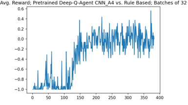

# Playing Connect4 with a Deep-Q-Learning Agent

### Background:

- **Q-learning** is a model-free reinforcement learning algorithm that learns the quality of actions to take under certain circumstances. The algorithm focuses on optimizing the value function according to the environment or problem. The Q in Q-learning represents the quality with which the model finds its next action, improving the quality. The Q-Table helps to find the best action for each state. Q-learning is advantageous because it is model-free, can optimize to get the best possible result without being strictly tethered to a policy, is flexible, and can be trained offline.

- **Deep Q-Learning** is a variant of Q-Learning that uses a deep neural network to represent the Q-function. This allows the algorithm to handle environments with a large number of states and actions, as well as to learn from high-dimensional inputs such as images or sensor data. The deep Q-learning model combines Q-learning and a neural network to find the optimal Q-value function. The algorithm finds the input and the optimal Q-value for all possible actions as the output.

Where **s** denotes the current state of the game, **a** denotes the current action and **s'** the next state of the game, the reinforcement learning algorithm uses Bellman's Equation to update the agents policy:

1. Create units of "experience" **(s,a,s',reward)** through play

<center></center>

2. Update Q-Values for the state via Bellman's equation

<center></center>

3. Train Deep-Q Network (the image depicts the network architecture and the early stopping criteria used)

<center></center>

... and repeat.

### Utilizing Opponents Experience

I had the idea to capture the opponents point of view as experience of my own (i.e. the agent). This should be possible in games with full information. I think it greatly accelerates learning. Without this method it can take a long time for the agent to experience wins against stronger agents.

<center></center>

### Training Protocol (loosely)

#### 1st Training
- Agent first learned to play against Negamax (negamax agent provided by kaggle)
- Retrained after every 32 games (total of 32000 games)
- Memory cleared after every 32 games (difficulty processing large batches >100 games; as agent improves, past experience is less valuable?!)
- Epsilon greedy policy applied to each move (epsilon = 10%)
- Avg. Reward over 32 games plotted

<center></center>

- Note that the agent dominates Negamax after this training. The epsilon greedy policy drags the average reward down substantially.

#### 2nd Training
- Agent then learned to play a rule-based agent which dominates Negamax
- After the agent learned to consistently defeat the rule-based agent, the agent no longer performed very well against Negamax. Perhaps the training sample is too narrow/specialised.

<center></center>

#### Later training against ensemble opponent
For each game, the opponent ist selected at random. A batch then consists of games against multiple opponents. This I believe is a good approach if you're not applying **experience replay**.


### Import and Initiate


```python
from kaggle_environments import evaluate, make, utils
from IPython.display import clear_output
import numpy as np
import random as rand
import pandas as pd
import matplotlib.pyplot as plt

env = make("connectx", debug=True)
env.render()
```


```python
#import neural network architectures
from NN_architecture import CNN_A1, CNN_A2, CNN_A3, CNN_A4
#import Deep Q Learning Model Class "QModelClass"
from DeepQAgent2 import QModelClass
```


```python
#load/initiate an instance of the Deep Q Learning Model Class "QModelClass"
DQMInstance = QModelClass(model_name ="allstar_A4_twoface5", exploration_factor=0.9, alpha= 0.3, early_stopping = True, configuration= env.configuration, model_architecture = CNN_A4)
DQMInstance.load_model()
```


```python
#define the agent with eps-greedy policy
def dqn_agent(observation, configuration):
    
    board_state = DQMInstance.obs_to_board_state(observation)
    #epsilon greedy policy
    p = rand.uniform(0, 1)

    if p < DQMInstance.exp_factor:
        #exploitation move
        move = DQMInstance.current_optimal_move(board_state)
    else:
        #exploration move
        all_options = DQMInstance.all_options(board_state)
        move = int(rand.choice(all_options))
            
    return move
```


```python
# #define weaker (parameters less trained) agent with exploitative policy 
# DQMInstanceB = QModelClass(model_name ="allstar_A4_twoface4", exploration_factor=0.9, alpha= 0.5, early_stopping = True, configuration= env.configuration, model_architecture = CNN_A4)
# DQMInstanceB.load_model()

# def dqn_exploit_agentB(observation, configuration):
#     board_state = DQMInstanceB.obs_to_board_state(observation)
#     move = DQMInstanceB.current_optimal_move(board_state)       
#     return move
```


```python
#define agent with purely exploitative policy 
def dqn_field_agent(observation, configuration):
    board_state = DQMInstance.obs_to_board_state(observation)
    move = DQMInstance.current_optimal_move(board_state)  
    return move
```


```python
# #agent incorporating "foresight" (minmax algo on top the deep-q algo)
# def dqn_foresight_field_agent(observation, configuration):
#     board_state = DQMInstance.obs_to_board_state(observation)
#     move = DQMInstance.foresight_optimal_move(board_state)    
#     return move
```


```python
#import other agents (negamax from kaggle, agent_rule_based found online)
from agent_rule_based import rule_based_agent
from negamax import negamax_agent
```


```python
DQMInstance.reset_memory()
```

### Train agent


```python
# number of epochs (one epoch here actually refers to a full game)
epochs_n = 100000
# after how many epochs do we train
training_batch = 32
# rewards stored in array
rewards = []

for epoch in range(1, epochs_n + 1):
    
    print(f"Epoch: {epoch}")
    
    #ensemble training: 
        #agent randomly plays against negamax, agent_rule_based or itself
    j = np.random.randint(3)
        #agent randomly starts first or second
    l = np.random.randint(2)
    if j == 0:
        if l == 0:
            AGENT = rule_based_agent
            trainer = env.train([None, dqn_agent])
            print("rule_based_agent vs dqn_agent")
        if l == 1:
            AGENT = dqn_agent
            trainer = env.train([None, rule_based_agent])
            print("dqn_agent vs rule_based_agent")
    if j == 1:
        if l == 0:
            AGENT = negamax_agent
            trainer = env.train([None, dqn_agent])
            print("negamax vs dqn_agent")
        if l == 1:
            AGENT = dqn_agent
            trainer = env.train([None, "negamax"])
            print("dqn_agent vs negamax")
    if j == 2:
        AGENT = dqn_agent
        trainer = env.train([None, dqn_agent])
        print("dqn_agent vs dqn_agent")

    observation = trainer.reset()
    done = False
    move_count = 0
    
    while not done:
        #state
        board_state = DQMInstance.obs_to_board_state(env.state[0].observation)
        
        move_count += 1
        if move_count > 1:
            #load experience to memory
            DQMInstance.load_to_memory(DQMInstance.prev_state, DQMInstance.prev_move, board_state, DQMInstance.reward(env.state[0].status, env.state[0].reward))
        if move_count > 2:
            #load opponents experience to memory
            DQMInstance.load_opponents_experience_to_memory(DQMInstance.past_prev_state, DQMInstance.past_prev_move, DQMInstance.prev_state, DQMInstance.prev_move, 
                                                DQMInstance.prev_reward_opponent)
        #action
        my_action = AGENT(env.state[0].observation, env.configuration)
        #reward
        observation, reward, done, info = trainer.step(my_action)
        #cache previous move
        DQMInstance.past_prev_state = DQMInstance.prev_state
        DQMInstance.past_prev_move = DQMInstance.prev_move
        DQMInstance.prev_state = board_state
        DQMInstance.prev_move = my_action
        DQMInstance.prev_reward = env.state[0].reward
        DQMInstance.prev_reward_opponent = env.state[-1].reward
    
    #final state
    board_state_game_finish = DQMInstance.obs_to_board_state(env.state[0].observation)
    #load experience to memory
    DQMInstance.load_to_memory(DQMInstance.prev_state, DQMInstance.prev_move, board_state_game_finish, DQMInstance.reward(env.state[0].status, env.state[0].reward))
    
    #load opponents experience to memory
    #print(np.count_nonzero(DQMInstance.prev_state-board_state_game_finish))
    if np.count_nonzero(DQMInstance.prev_state-board_state_game_finish) <= 1:
        DQMInstance.load_opponents_experience_to_memory(DQMInstance.past_prev_state, DQMInstance.past_prev_move, DQMInstance.prev_state, DQMInstance.prev_move, env.state[-1].reward)
    if np.count_nonzero(DQMInstance.prev_state-board_state_game_finish) == 2:
        DQMInstance.load_opponents_experience_to_memory(DQMInstance.past_prev_state, DQMInstance.past_prev_move, DQMInstance.prev_state, DQMInstance.prev_move, 0)
        board_state_1 = DQMInstance.make_state_from_move(DQMInstance.prev_state, DQMInstance.prev_move)
        board_state_2 = board_state_game_finish
        opp_move = DQMInstance.opponent_move_from_states(board_state_1, board_state_2)
        DQMInstance.memory.append([DQMInstance.switch_sides(board_state_1), opp_move, DQMInstance.switch_sides(board_state_2), env.state[-1].reward])

    print(f"Reward: {reward}")
    rewards.append(reward)
    
    #Offline (Batch) training
    if epoch % training_batch == 0:
        #fit DQ model to current batch of memory
        DQMInstance.learn_batch(DQMInstance.memory)
        #save model after every training (training may crash)
        DQMInstance.save_model()
        #empty memory after every batch
        DQMInstance.reset_memory()
        #save rewards for this batch of epochs
        DQMInstance.save_rewards(rewards)
        
        rewards = []

    
    clear_output(wait=True)
```

### Plot training results (mean reward per training batch)


```python
reward_means = [] 
batches = []

for batch in range(1, 500):
    rm = pd.read_pickle("data/rewards_list_allstar_A4_twoface5_" + str(batch) + ".pkl")
    reward_means.append(np.mean(rm))
    batches.append(batch)
    
plt.title("Avg. Reward; Pretrained Deep-Q-Agent CNN_A4 vs. RBA & Negamax; Batches of 32")
plt.plot(batches,reward_means)

plt.savefig('data/Deep-Q-Agent CNN_A4 vs. RBA & Negamax.jpg',bbox_inches='tight', dpi=150)
```


```python
reward_means = [] 
batches = []

for batch in range(1, 1600):
    rm = pd.read_pickle("data/rewards_list_allstar_A4_twoface_" + str(batch) + ".pkl")
    reward_means.append(np.mean(rm))
    batches.append(batch)
    
plt.title("Avg. Reward; DQA CNN_A4 with two sight vs. ensemble; Batches of 32")
plt.plot(batches,reward_means)

plt.savefig('data/DQA CNN_A4 with two sight vs. ensemble.jpg',bbox_inches='tight', dpi=150)
```

### Evaluate the trained model by having the purely exploitative agent play opponents

The Deep Q agent can be seen to dominate both negamax and the rule based agent starting first and second.


```python
#evaluate("connectx", [dqn_field_agent, dqn_foresight_field_agent], num_episodes=20)
```


```python
#evaluate("connectx", [dqn_foresight_field_agent, dqn_field_agent], num_episodes=20)
```


```python
evaluate("connectx", [dqn_field_agent, "negamax"], num_episodes=20)
```


    [[-1, 1],
     [1, -1],
     [1, -1],
     [1, -1],
     [1, -1],
     [-1, 1],
     [1, -1],
     [1, -1],
     [1, -1],
     [1, -1],
     [1, -1],
     [1, -1],
     [1, -1],
     [-1, 1],
     [1, -1],
     [1, -1],
     [0, 0],
     [1, -1],
     [1, -1],
     [1, -1]]


```python
evaluate("connectx", ["negamax", dqn_field_agent], num_episodes=20)
```


    [[0, 0],
     [1, -1],
     [-1, 1],
     [1, -1],
     [-1, 1],
     [-1, 1],
     [-1, 1],
     [-1, 1],
     [-1, 1],
     [-1, 1],
     [0, 0],
     [-1, 1],
     [-1, 1],
     [-1, 1],
     [-1, 1],
     [-1, 1],
     [-1, 1],
     [0, 0],
     [0, 0],
     [-1, 1]]


```python
evaluate("connectx", [dqn_field_agent, rule_based_agent], num_episodes=20)
```


    [[1, -1],
     [1, -1],
     [1, -1],
     [1, -1],
     [1, -1],
     [1, -1],
     [1, -1],
     [1, -1],
     [1, -1],
     [1, -1],
     [1, -1],
     [1, -1],
     [1, -1],
     [1, -1],
     [1, -1],
     [1, -1],
     [1, -1],
     [1, -1],
     [1, -1],
     [1, -1]]


```python
evaluate("connectx", [rule_based_agent, dqn_field_agent], num_episodes=20)
```


    [[-1, 1],
     [-1, 1],
     [-1, 1],
     [-1, 1],
     [-1, 1],
     [-1, 1],
     [-1, 1],
     [-1, 1],
     [-1, 1],
     [-1, 1],
     [-1, 1],
     [-1, 1],
     [-1, 1],
     [-1, 1],
     [-1, 1],
     [-1, 1],
     [-1, 1],
     [-1, 1],
     [-1, 1],
     [-1, 1]]


